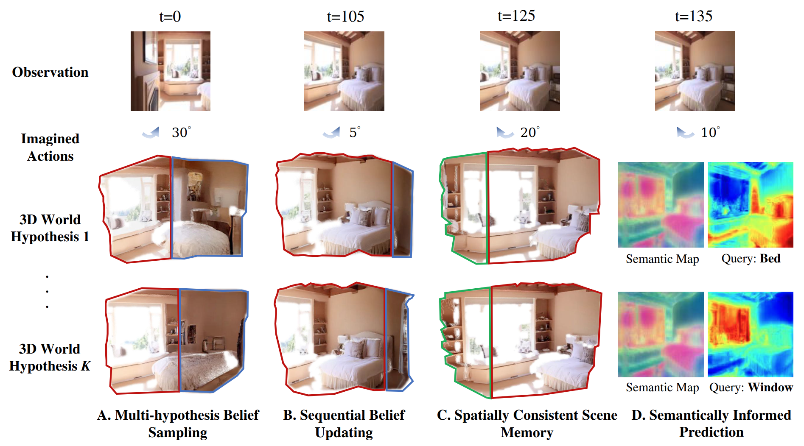

<h1 align="center"><a href="https://3d-belief.github.io">3D-Belief: A Generative 3D World Model for Embodied Reasoning and Planning</a></h1>

<div align="center">

<a href="https://3d-belief.github.io" target="_blank" rel="noopener noreferrer"></a>
<a href="https://3d-belief.github.io/static/3D_Belief.pdf" target="_blank" rel="noopener noreferrer"></a>
<a href="https://huggingface.co/datasets/SCAI-JHU/3d-belief"></a>

</div>



## 3D-Belief

We propose **3D-Belief**, a generative 3D world model that predicts unseen regions in an explicit, actionable 3D representation from partial observations and updates this belief online as new observations arrive. It enables embodied agents to reason about the 3D world under partial observability and make sequential decisions based on up-to-date beliefs.

- **Multi-hypothesis Belief Sampling**: generates diverse 3D scene completions from partial observations, explicitly representing uncertainty over unobserved regions so the agent can plan against multiple possible world states.
- **Sequential Belief Updating**: refines the 3D belief online at each time step as new observations arrive, ensuring the agent always acts on the most current and consistent world representation.
- **Spatially Consistent Scene Memory**: maintains a coherent 3D memory that preserves previously observed regions accurately while integrating new information, avoiding drift or contradiction across time.
- **Semantically Informed Future Prediction**: leverages semantic queries to guide prediction in unobserved regions, enabling goal-directed imagination about where relevant objects are likely to be found.

## 🎉 News

- **[2026-04]** Code, pretrained checkpoints, and processed data released on [HuggingFace](https://huggingface.co/datasets/SCAI-JHU/3d-belief).
- **[2026-04]** 3D-CORE benchmark released — covering object completion, room completion, and object permanence tasks.
- **[2026-04]** Project website and paper live at [3d-belief.github.io](https://3d-belief.github.io).

## Quick Links

- [Installation](#installation)
  - [Environment Setup](#environment-setup)
  - [Third-Party Packages](#third-party-packages)
- [Data & Checkpoints](#data--checkpoints)
- [Evaluation](#evaluation)
  - [Object Navigation (AI2-THOR)](#object-navigation-ai2-thor)
  - [3D Contextual Reasoning (3D-CORE)](#3d-contextual-reasoning-3d-core)
- [Repository Structure](#repository-structure)
- [Citation](#citation)

## Installation

### Environment Setup

```bash
git clone https://github.com/3D-Belief/3d-belief
cd 3d-belief
git submodule update --init --recursive
conda create -n 3d-belief python=3.10 -y
conda activate 3d-belief
conda install -c conda-forge ninja gcc_linux-64=9 gxx_linux-64=9 moviepy swig
# Install the one matching your CUDA version
conda install -c nvidia cuda=12.1

export PATH=$CONDA_PREFIX/bin:$PATH
export CUDA_HOME=$CONDA_PREFIX
export LD_LIBRARY_PATH=$CONDA_PREFIX/lib:$LD_LIBRARY_PATH

# Install PyTorch matching your CUDA version
pip3 install torch torchvision torchaudio --index-url https://download.pytorch.org/whl/cu121
conda install -y -c fvcore -c iopath -c conda-forge fvcore iopath
conda install vulkan-tools
pip install --no-build-isolation -r requirements.txt
pip install -e .
```

### Third-Party Packages

```bash
cd third_party/dfot
pip install -r requirements.txt
cd ../spoc
pip install --no-build-isolation -e .
pip install -r requirements.txt
pip install --extra-index-url https://ai2thor-pypi.allenai.org ai2thor==0+5d0ab8ab8760eb584c5ae659c2b2b951cab23246
python -m scripts.download_training_data --save_dir ../../data --types all
python -m objathor.dataset.download_annotations --version 2023_07_28 --path ../../data
python -m objathor.dataset.download_assets --version 2023_07_28 --path ../../data
python -m scripts.download_objaverse_houses --save_dir ../../data --subset val
```

## Data & Checkpoints

Log in to your HuggingFace account from the project root:

```bash
hf auth login
```

Download all pretrained checkpoints:

```bash
hf download SCAI-JHU/3d-belief --repo-type dataset --local-dir ./ --include "checkpoints/**"
```

Download and set up evaluation data:

```bash
hf download SCAI-JHU/3d-belief --repo-type dataset --local-dir ./ --include "data/**"
# Unzipping may take several minutes
unzip ./data/spoc_trajectories_val.zip -d ./data/ && rm data/spoc_trajectories_val.zip
unzip ./data/3d-core.zip -d ./data/ && rm data/3d-core.zip
```

## Evaluation

### Object Navigation (AI2-THOR)

Configure paths at `wm_baselines/config/paths.yaml`. For VLM-based models, export your API keys:

```bash
export OPENAI_API_KEY=your_openai_api_key
export GEMINI_API_KEY=your_gemini_api_key
```

Run evaluation for a selected model:

```bash
bash scripts/rollouts/object_searching.sh 3d_belief_semantic_goal_selector
```

Available model keys: `gpt_vlm_agent`, `gemini_vlm_agent`, `qwen3_vlm_agent`, `vggt_frontier`, `vggt_gpt_vlm_goal_selector`, `dfot_vggt_gpt_vlm_goal_selector`

Evaluate predicted trajectories:

```bash
python scripts/calculate_metrics/obj_searching_metrics.py <path_to_predicted_trajectories>
```

### 3D Contextual Reasoning (3D-CORE)

3D-CORE includes three tasks:
- **Object Completion** (`obj_comp_*`)
- **Room Completion** (`room_comp_*`)
- **Object Permanence** (`obj_perm_*`)

Run one task/model pair:

```bash
bash scripts/rollouts/reasoning.sh obj_comp_3d_belief
```

Available agent keys:
- `obj_comp_3d_belief`, `room_comp_3d_belief`, `obj_perm_3d_belief`
- `obj_comp_dfot_vggt`, `room_comp_dfot_vggt`, `obj_perm_dfot_vggt`

We use Gemini-2.5-Flash for evaluation — export your key:

```bash
export GEMINI_API_KEY=your_gemini_api_key
```

Evaluate each task:

```bash
python scripts/calculate_metrics/obj_comp_metrics.py <path_to_predicted_trajectories>
python scripts/calculate_metrics/room_comp_metrics.py <path_to_predicted_trajectories>
python scripts/calculate_metrics/obj_perm_metrics.py <path_to_predicted_trajectories>
```

## Repository Structure

```
3d-belief/
├── splat_belief/          # 3D-Belief model
│   ├── diffusion/         # Diffusion model wrapper
│   ├── splat/             # 3D Gaussian Splat scene representation
│   ├── embodied/          # Embodied related tools
│   ├── config/            # Model configs
│   └── data_io/           # Data loading utilities
├── wm_baselines/          # Baseline world model agents
│   ├── agent/             # Agent implementations
│   ├── world_model/       # World model wrappers
│   ├── planner/           # Motion planning modules
│   ├── task_manager/      # Task management
│   ├── workspace/         # Evaluation entry points
│   └── config/            # Baseline configs including paths.yaml
├── scripts/
│   ├── training/          # Training and vision evaluation scripts
│   ├── rollouts/          # Embodied evaluation scripts
│   └── calculate_metrics/ # Per-task metric evaluation scripts
└── third_party/           # Submodules
```

## Citation

If you find 3D-Belief useful in your research, please cite:

```bibtex
@misc{yin20263dbelief,
  title={3D-Belief: A Generative 3D World Model for Embodied Reasoning and Planning},
  author={Yin, Yifan and Wen, Zehao and Chen, Jieneng and Zheng, Zehan and Dai, Nanru and Shi, Haojun and Ye, Suyu and Huang, Aydan and Zhang, Zheyuan and Yuille, Alan and Xie, Jianwen and Tewari, Ayush and Shu, Tianmin},
  year={2026},
  url={https://3d-belief.github.io/}
}
```
